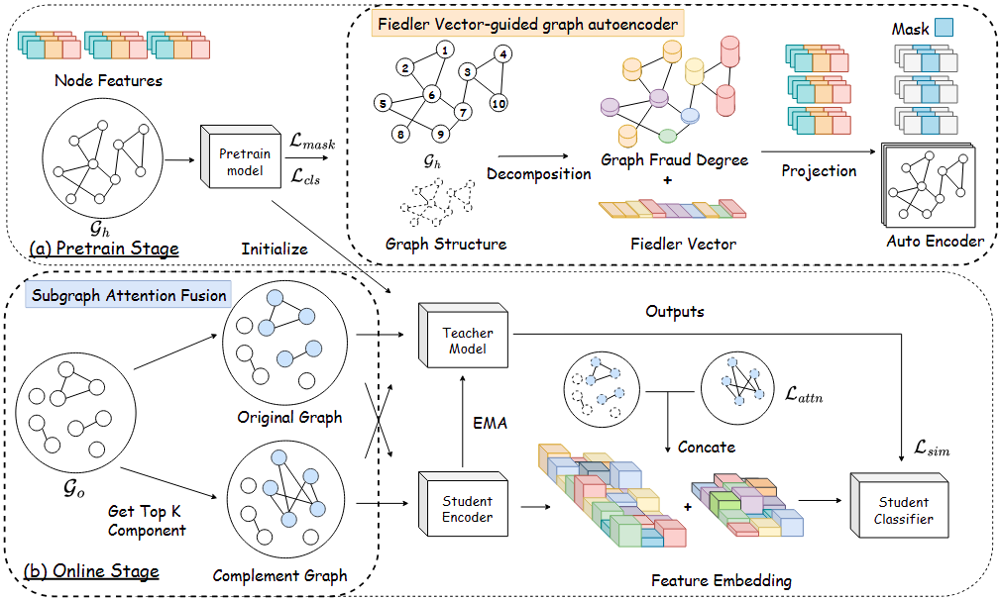

# ConFVG
[ICLR 26 Poster] Healthcare Insurance Fraud Detection via Continual Fiedler Vector Graph Model


## 📢 Updates
- **[2026/01/26]** 🎉🎉🎉 Our paper **ConFVG** has been accepted by **ICLR 2026**!  

## 🖋️ Overview of ConFVG



## 📚 Citation
If you find our work useful in your research, please consider citing:
```bibtex
@inproceedings{zhang2026healthcare,
  title={Healthcare Insurance Fraud Detection via Continual Fiedler Vector Graph Model},
  author={Yehan Zhang and Huaidong Zhang and Xuandi Luo and Shengfeng He},
  booktitle={The Fourteenth International Conference on Learning Representations (ICLR)},
  year={2026},
  url={https://openreview.net/forum?id=ZWDvIKMkMG}
}
